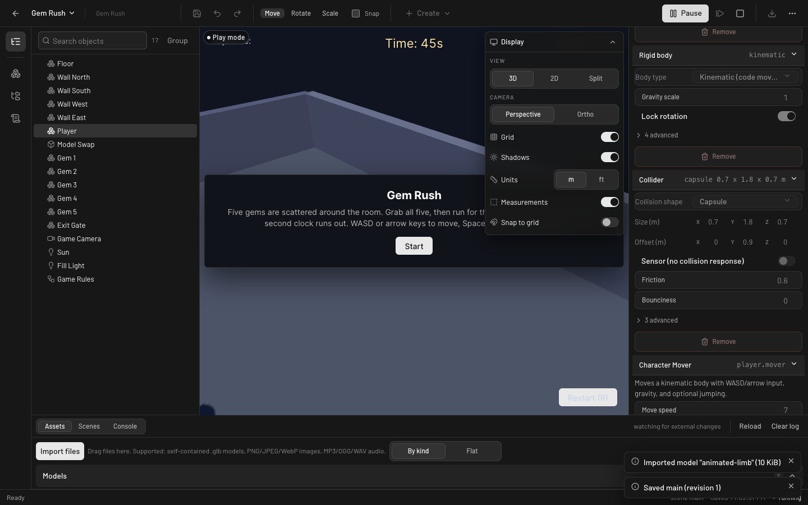
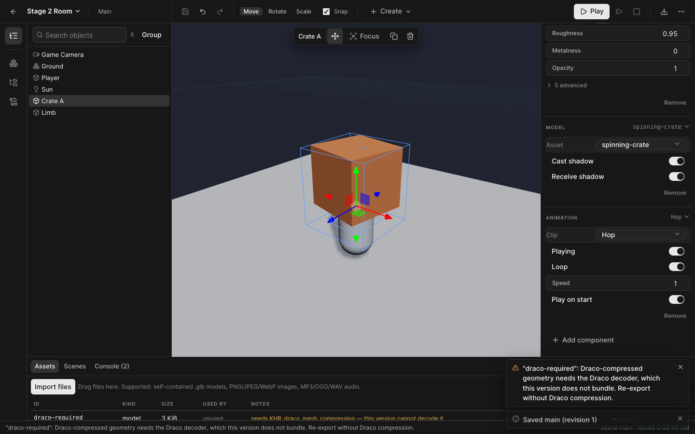

<p align="center">
  
</p>

# Coilbox

[](https://github.com/0xCarnival/coilbox/actions/workflows/verify.yml)

A local-first, open-source game studio built around Three.js: create or generate a game,
open it in the studio, select and move things, change gameplay settings, press Play, save,
and export a standalone browser game.

This repository implements `docs/threejs-game-studio-plan.md`. Progress against the plan's
stage gates is tracked in `docs/status.md`.

## Status

**Every stage of the plan is complete and verified.** The studio can create and open projects,
edit a scene in a viewport with a transform inspector, import models/images/audio, place models
and play their animation clips, undo/redo, save through the workspace service, play the scene
with the same runtime an export uses, stop without disturbing the authored document, and export
a standalone playable web build. Three complete games — `games/collect-room`,
`games/physics-targets`, and `games/gem-rush` (built by a separate agent from the documented
contract alone) — run on that shared runtime with registered behaviors, input, a HUD, and game
rules.

- `pnpm verify:stage0` — 14/14 checks (runtime, physics, teardown, WASM delivery)
- `pnpm verify:stage1` — 12/12 checks (authoring loop end to end, pause and step)
- `pnpm verify:stage2` — 15/15 checks (assets, clips, property controls, keyboard focus, drag cancellation)
- `pnpm verify:stage3` — 14/14 checks (both demo games played end to end, wall contact, tuning editable)
- `pnpm verify:stage4` — 17/17 checks (agent-built game, human edit, independence, management)
- `pnpm verify:stage5` — 23/23 checks (compatibility, resource ownership, reference-scene
  performance, the release acceptance session, and an export served with the service shut down)
- `pnpm lint` — the architectural rules: one vendor boundary, one renderer, runtime never imports
  editor, styling stays in the editor, and no low-evidence assertions
- `pnpm verify` — every gate in order (lint plus stages 0-5); 7/7 gates pass

See `docs/status.md` for the per-stage detail, `docs/runbook.md` for start-up and recovery, and
`docs/evidence/` for the raw results.

## What it looks like

The editor, with a game running in Play mode. The HUD, the inspector, and the asset browser are the
same code an export ships.



Authoring a scene with an imported model, its material, and its animation clip — all of it document
edits, none of it code.



## Requirements

- Node.js 24.x (pinned toolchain; see `docs/pinned-versions.md`)
- pnpm 11.x

## Running it

```bash
pnpm install --frozen-lockfile   # once
pnpm dev
```

That starts the workspace service (loopback, proxied at `/api`) and the Vite dev server, and prints
the editor, probe, and workspace paths when it is ready:

- **http://127.0.0.1:5178/index.html** — the editor. Open a project, press **Play** to run it with
  the same runtime an export ships, then **Pause** / **Step** / **Stop**. Pressing Play dismisses a
  start overlay and unlocks audio, which browsers only allow after a user gesture.
- **http://127.0.0.1:5178/probe.html** — the stage 0 runtime probe (falling box, Play/Pause/Step/Stop).
- **http://127.0.0.1:5178/player.html?project=./games/collect-room/** — a game as a plain player
  page, loading its project from files exactly as an export does. Swap in `physics-targets` or
  `gem-rush`; the default workspace is `games/`.

`Ctrl+C` stops both processes. The three games in `games/` are the worked examples; `templates/`
holds the starter projects `pnpm studio create` copies from.

### Running an exported game

```bash
pnpm studio build gem-rush     # writes games/gem-rush/.coilbox/export/
npx --yes serve games/gem-rush/.coilbox/export
```

An export needs no editor, no workspace service, and no development server — serve the folder over
HTTP. Opening `index.html` from `file://` is **not** supported, because browsers block module and
WASM loading from the filesystem.

### Variants

```bash
pnpm dev -- --port 6000                    # move the editor off 5178
pnpm studio api --port 5179                # workspace service only (prints its session token)
COILBOX_WORKSPACE=~/my-games pnpm dev    # work in a different workspace folder
pnpm studio list --workspace ~/my-games    # every project command accepts --workspace
```

If the dev server will not start or a project misbehaves, `docs/runbook.md` has the recovery steps
(port checks, workspace checks, stale saves, conflicting external edits, newer schema versions).

## Commands

```bash
# Development
pnpm dev              # workspace service + editor dev server (http://127.0.0.1:5178/)
pnpm lint             # architectural + low-evidence rules (anti-slop + coilbox)
pnpm typecheck        # tsc --noEmit
pnpm test             # unit tests (including the real Box3D WASM in Node)
pnpm build            # production build into dist/

# Projects (what an agent uses)
pnpm studio list                              # projects in the workspace
pnpm studio create my-game --template blank   # templates: blank, collect-room, physics-targets
pnpm studio validate my-game                  # structural and relationship validation
pnpm studio test my-game                      # validate + export + play headlessly, with exit status
pnpm studio build my-game                     # standalone web build in .coilbox/export

# Project management
pnpm studio duplicate my-game --as my-game-2 --name "My Game 2"
pnpm studio archive my-game --reason "superseded"
pnpm studio archives
pnpm studio restore <archive-name>
pnpm studio export-source my-game --out my-game.tar.gz
pnpm studio import my-game.tar.gz --as my-game-imported
pnpm studio api --port 5179                   # workspace service only

# Verification
pnpm verify:stage0    # stage 0 gate: runtime, physics, teardown, WASM delivery
pnpm verify:stage1    # stage 1 gate: the whole authoring loop in a headless browser
pnpm verify:stage2    # stage 2 gate: assets, model instancing, clip playback
pnpm verify:stage3    # stage 3 gate: plays both demo games in a headless browser
pnpm verify:stage4    # stage 4 gate: agent contract, management, external-change conflicts
pnpm verify:stage5    # stage 5 gate: release checks, acceptance session, export independence
pnpm verify           # every gate in order, with one exit status

# Generators
pnpm fixtures         # regenerate the binary test fixtures from code
pnpm games            # regenerate the three demo games from code
pnpm templates        # regenerate templates/ from code
pnpm probe-project    # regenerate public/probe-project/ from code
```

## Layout

```text
src/
  schema/     project, scene, and component documents (Zod plus relationship checks)
  runtime/    the reusable game runtime; never imports editor code
    physics/  Box3D adapter — the only module allowed to import the vendor binding
    behaviors/ registered behaviors, their declarative metadata, and the runtime that runs them
    assets/   GLTF loading, instancing, and asset resolution
    hud/      shared HTML/CSS HUD (self-contained; no editor styling)
    input/    action-based input
    project/  loading and validating a project from plain files
    probe/    the stage 0 probe scene, defined in code so tests and pages share it
  editor/     editor shell, panels, imperative viewport, command history
  player/     standalone game entry point (what an export runs)
  probe/      the stage 0 probe page
server/       local workspace service: project storage, assets, management, build, test
tools/        the stage gates, generators, static server, and the verify runner
games/        the demonstration games (also the default workspace root)
templates/    whole-project starter copies for `pnpm studio create`
public/       static assets served verbatim (the probe project)
tests/        unit tests, the stage 0 check suite, and fixtures
docs/         plan, status, runbook, project format, engine SDK, agent contract, evidence
```

The plan itself is `docs/threejs-game-studio-plan.md`; `docs/status.md` records what each stage
demonstrated and which gaps are knowingly left open.

## Principles this code follows

- The authored document is the source of truth; Three.js objects are a projection of it.
- One runtime loads the same scene format in editor preview and exported games.
- Every vendor call lives behind `runtime/physics/box3d-adapter.ts`.
- Physics owns dynamic transforms; the render loop interpolates and never fights it.
- Play builds a fresh world from a snapshot, so Stop simply discards it.
- Editor-only visibility and locking never change whether content is enabled in the game.

## Licence

MIT. Third-party notices for bundled dependencies are added with the export pipeline.
