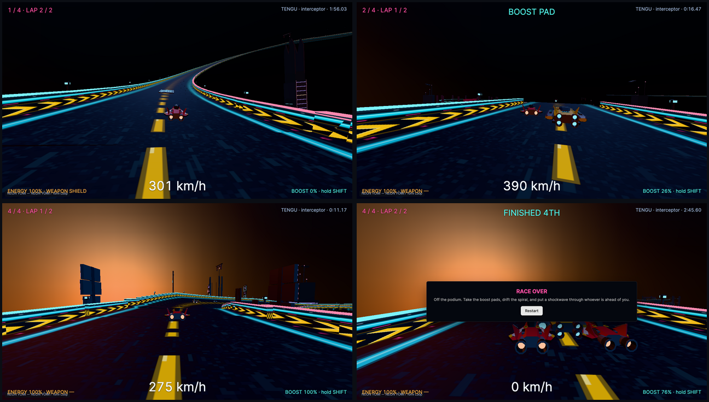

# NEON YOMI

Anti-gravity combat racing over the drowned city. Two laps of the Yomi Loop, three rivals,
three hulls.

> The sea took Tokyo a hundred and fifty years ago. The lower city is a black lagoon lit from
> beneath by drowned signage. Nine megatower crowns still break the surface, joined by the Yomi
> Loop — exposed maglev decks, broken expressway spans, and the Kannon Spire, which is dead, and
> which you will fall through twice.

## Play

```bash
pnpm dev                                  # workspace service + editor
pnpm studio test neon-yomi                # validate, export, and play it headlessly
pnpm studio build neon-yomi               # standalone web build in .coilbox/export
```

Open **NEON YOMI** from the editor's project list and press **Play**. To play an export without
the editor, serve `games/neon-yomi/.coilbox/export/` over HTTP.



## Controls

| Action | Keys |
| --- | --- |
| Thrust / brake | `W` `S` or `↑` `↓` |
| Steer | `A` `D` or `←` `→` |
| Air brake left / right | `Q` / `E` — hold one to drift, both to slam the brakes |
| Boost | `Shift` (the meter recharges while you drift) |
| Fire | `Space` or `F` |
| Choose hull | `1` KITSUNE · `2` TENGU · `3` ONI |
| Restart | `R` |

## The three hulls

| Hull | Class | Character |
| --- | --- | --- |
| **KITSUNE** | speeder | Featherlight glass cannon. Fastest hull on the loop, thinnest armour, hits hardest. |
| **TENGU** | interceptor | The balanced one. Best grip, quick to rotate, no weaknesses to exploit. |
| **ONI** | bulwark | Heavy and armoured. Slowest to build speed, shrugs off hits, carries the biggest reactor. |

Press `1`, `2` or `3` **before the lights go out** to change hull; the choice applies at the start
of the race.

## The circuit

One lap runs about 5.6 km through twelve beats: the Yomi Gate launch deck, the Neon Straight, the
banked Kaminari right, the Kanzashi chicane, **the Plunge** (rails end, a 46 m gap, and a long
drop), the Suijin left, the breach into the dead Kannon Spire, a three-and-a-quarter turn reactor
spiral falling through the dark, the flooded gallery floor, the climb back to daylight, the
typhoon crossing, and the home sweep.

It is a **two-lap** race — a full tour of the circuit twice. The deck falls 193 m from the launch
roof to the gallery floor and climbs back, and the
steepest surface anywhere on it is 17.5 degrees.

Boost pads stay live for everyone. Weapon, shield and energy pods respawn a few seconds after
someone takes them. Rivals hunt the racing line, ram when you are slow, and use whatever they pick
up.

## Layout

```text
game.json               project manifest — scenes, render settings, HUD, input bindings
scenes/main.scene.json  the whole circuit: track, waypoints, pickups, craft, dressing
scripts/registry.json   the registered behaviors this project uses, with their properties
assets/                 imported models, textures and audio, with content hashes
```

Everything except the assets is diffable text. The scene is generated by a track generator that
walks a description of the circuit's beats and emits deck segments, rails, waypoints, pickups and
dressing; the generator is not part of the project because it is build tooling rather than game
data.

## Current limitations

This is the larger showcase: its 2,734 entities make the editor viewport slow on some systems.
Simpler viewport shading, reduced draw calls, and navigation improvements are planned follow-up
work. Static models currently produce harmless warnings about having no animation clips.
The engine sound plays as a cue; a continuous engine drone is not implemented.

## Tuning

Every number that shapes how the race feels is a behavior property, editable in the inspector with
the entity selected — `racer.craft` (hover height and stiffness, gravity, speed scale, boost
charge, and the AI's skill, aggression, lane offset and rubber banding), `racer.chase-camera`
(distance, height, look-ahead, bank amount, speed pull-back, damping), `racer.pickup` (radius,
respawn, spin, bob), and `racer.director` (laps, countdown, podium places, win message).
